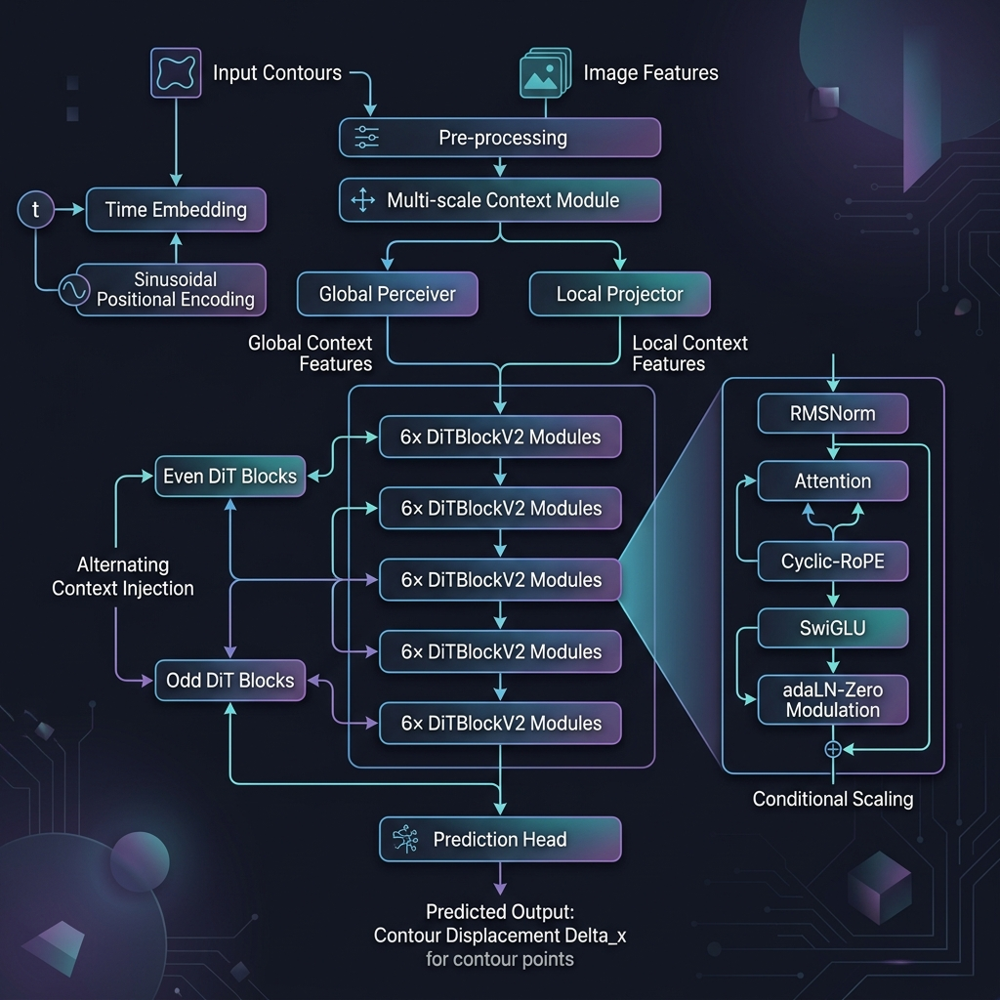
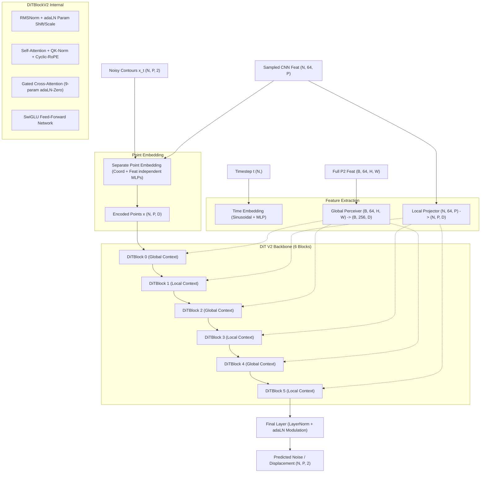

# Diffusion Snake - DiT V2 Architecture



## 1. Overview
The **DiT V2 (Diffusion Transformer V2)** is a state-of-the-art denoising backbone designed for medical image contouring. It replaces the original GCN-based evolution with a high-performance transformer architecture inspired by **DiT (Diffusion Transformers)** and **SD3/MM-DiT**.

## 2. Technical Diagram (Mermaid)



## 3. Key Components [M1-M6]

| ID | Component | Description | Benefit |
|:---|:---|:---|:---|
| **M1** | **Multi-granularity Injection** | Even layers use Global Perceiver features, Odd layers use Local Sampled features. | Balances global semantic understanding with local boundary accuracy. |
| **M2** | **Separate Point Embedding** | Independent MLPs for coordinates (2D) and features (64D) before fusion. | Prevents coordinates from being washed out by high-dimensional features. |
| **M3** | **Cyclic-RoPE 1D** | 1D Rotary Positional Encoding mapped to a cycle $2\pi i/P$. | Perfect for closed contours; start-point invariant relative positioning. |
| **M4a** | **RMSNorm** | Replaces LayerNorm with Root Mean Square Layer Normalization. | Higher numerical stability and faster computation. |
| **M4b** | **SwiGLU FFN** | Replaces ReLU/SiLU GELU with Gated Linear Units. | Superior feature representation capacity (standard in LLaMA-style LLMs). |
| **M4c** | **QK-RMSNorm** | Normalizes Queries and Keys before attention score calculation. | Prevents attention logit blowup in deep transformers. |
| **M4d** | **9-param adaLN-Zero** | Expanded modulation to include Cross-Attention gating. | Allows the model to selectively ignore/emphasize image context based on $t$. |
| **M6** | **Final Modulation** | Final LayerNorm is modulated by time embeddings before prediction. | Ensures the output scale is strictly controlled by the diffusion noise level. |

## 4. Usage
To enable this architecture, set the following flags in your config YAML:
```yaml
use_dit_v2: true
dit_num_layers: 6
dit_num_heads: 8
dit_state_dim: 256
```

## 5. 数据流动详解 (Data Flow Analysis)

### 🌊 第一阶段：输入与特征对齐 (Input & Alignment)
- **原始输入**：图像 `[B, 3, 512, 512]` + 噪声轮廓 `[N, 128, 2]` + 时间步 `t [N]`。
- **时间嵌入**：`t` $\xrightarrow{\text{Sinusoidal + MLP}}$ `t_emb [N, 256]`。
- **全局上下文 (Global Context)**：整图 P2 特征经 Perceiver 压缩为 `global_ctx [B, 256, 256]`。
  - *关键步骤*：利用 `py_ind` 映射将图片维度 (B) 扩展到轮廓维度 (N)，得到 `[N, 256, 256]`。
- **局部上下文 (Local Context)**：轮廓点实时采样的特征投影为 `local_ctx [N, 128, 256]`。

### 🧬 第二阶段：隐藏状态构建 (Embedding)
- **分离点嵌入 (Separate Embedding)**：
  - 坐标 `[N, 128, 2]` $\xrightarrow{\text{MLP}}$ `[N, 128, 64]`。
  - 特征 `[N, 128, 64]` $\xrightarrow{\text{MLP}}$ `[N, 128, 192]`。
  - 拼接得到 `x [N, 128, 256]`。

### 🔄 第三阶段：骨干网交互循环 (Backbone Interaction)
在 6 层 DiTBlock 内部，`x [N, 128, 256]` 经历：
1. **自注意力 (Self-Attention)**：轮廓内部各点的空间拓扑约束学习，配合 **Cyclic-RoPE** 提供旋转位置感知。
2. **交叉注意力 (Cross-Attention) - M1 注入控制**：
   - **偶数层 (0, 2, 4)**：`x` 与 `global_ctx` 交互 $\rightarrow$ 获取整图语义。
   - **奇数层 (1, 3, 5)**：`x` 与 `local_ctx` 交互 $\rightarrow$ 获取局部边界细节。
3. **动态调制 (adaLN-Zero)**：通过 `t_emb` 动态控制层内所有 Gates 和 Scaling，实现依据 $t$ 的精准去噪。

### 🎯 第四阶段：输出预测 (Output Prediction)
- **最终修正**：使用 `t_emb` 对最后一层 `x` 进行调制。
- **投影输出**：`[N, 128, 256]` $\xrightarrow{\text{Linear}}$ `[N, 128, 2]`。
- **最终结果**：输出预测位移 $\Delta x$。

---

## 6. ASCII 可视化数据流 (Text-Based Flowchart)

```text
┌──────────────────┐      ┌────────────────────────────────┐
│   图像 (Image)    │      │     噪声轮廓 (Noisy Points)      │
│ [B, 3, 512, 512]  │      │          [N, P, 2]             │
└────────┬─────────┘      └──────────────┬─────────────────┘
         │                               │
  ┌──────┴──────┐                ┌───────┴──────┐        ┌─────────────┐
  │   YOLOv8    │                │  特征采样器  │        │ 时间步 (t)   │
  │ (特征提取器) │                │ (Point Sample)│        │    [N]      │
  └──────┬──────┘                └───────┬──────┘        └──────┬──────┘
         │                               │                      │
  ┌──────┴──────┐                ┌───────┴──────┐        ┌──────┴──────┐
  │ P2 特征图    │                │ 采样特征     │        │ Sin / MLP    │
  │[B, 64, 1282] │                │ [N, 64, P]   │        │ Embedding    │
  └──────┬──────┘                └───────┬──────┘        └──────┬──────┘
         │                               │                      │
  ┌──────┴──────┐                ┌───────┴──────┐        ┌──────┴──────┐
  │ Perceiver   │                │   投影层     │        │ t_emb [256] │
  │ (全局压缩)   │                │ (Local Proj) │        │ (控制参数)   │
  └──────┬──────┘                └───────┬──────┘        └──────┬──────┘
         │[B, 256, 256]                  │[N, P, 256]           │
         ▼                               ▼                      │
  ┌──────────────┐               ┌──────────────┐               │
  │  py_ind 扩展  │               │   分离嵌入   │               │
  │ (对齐到 N)    │               │ (Separate Pt)│               │
  └──────┬──────┘               └───────┬──────┘               │
         │[N, 256, 256]                  │[N, P, 256]           │
         │                               │                      │
         │           ┌───────────────────┴──────────────────────┤
         │           ▼                                          │
         │   ┏━━━━━━━━━━━━━━━━━━━━━━━━━━━━━━━━━━━━━━━━━━━━━┓     │
         │   ┃           DiT-Snake V2 Backbone             ┃     │
         │   ┣━━━━━━━━━━━━━━━━━━━━━━━━━━━━━━━━━━━━━━━━━━━━━┫     │
         └───┨ [Layer 0] 全局交互：x <-> Global_Context     ┠─────┤
             ┣─────────────────────────────────────────────┫     │
         ┌───┨ [Layer 1] 局部交互：x <-> Local_Context      ┠─────┤
         │   ┣─────────────────────────────────────────────┫     │
         └───┨ [Layer 2] 全局交互：x <-> Global_Context     ┠─────┤
             ┣─────────────────────────────────────────────┫     │
         ┌───┨ [Layer 3] 局部交互：x <-> Local_Context      ┠─────┤
         │   ┣─────────────────────────────────────────────┫     │
         └───┨ [Layer 4] 全局交互：x <-> Global_Context     ┠─────┤
             ┣─────────────────────────────────────────────┫     │
         ┌───┨ [Layer 5] 局部交互：x <-> Local_Context      ┠─────┤
         │   ┗━━━━━━━━━━━━━━━━━━━━━━━━━━━━━━━━━━━━━━━━━━━━━┛     │
         ▼                                                      │
  ┌──────────────┐                                              │
  │  Final 调制  │ <────────────────────────────────────────────┘
  │ (adaLN-Zero) │
  └──────┬──────┘
         │[N, P, 256]
         ▼
  ┌──────────────┐
  │  线性输出层  │
  └──────┬──────┘
         │[N, P, 2]
         ▼
  预测位移 (Predict Delta)
```
---

## 7. 极简版 DiT V2 拓扑图 (Snapshot Ready)

```text
       ┌──────────┐        ┌──────────┐        ┌──────────┐
       │ 图像分支  │        │ 轮廓分支  │        │ 时间步 t │
       └────┬─────┘        └────┬─────┘        └────┬─────┘
            │                   │                   │
     Global Perceiver     Point Embedding         t_emb
     [B, 256, 256]        [N, 128, 256]           [256]
            │                   │                   │
            │           ┌───────┴───────┐           │
            ▼           ▼               ▼           ▼
      ┏━━━━━━━━━━━━━━━━━━━━━━━━━━━━━━━━━━━━━━━━━━━━━━━┓
      ┃           DiT V2 Backbone (6 Blocks)          ┃
      ┣━━━━━━━━━━━━━━━━━━━━━━━━━━━━━━━━━━━━━━━━━━━━━━━┫
      ┃  Layer 0: x ←[Cross-Attn]→ Global (全图语义)  ┃
      ┃  Layer 1: x ←[Cross-Attn]→ Local  (边缘细节)  ┃
      ┃  Layer 2: x ←[Cross-Attn]→ Global (全图语义)  ┃
      ┃  Layer 3: x ←[Cross-Attn]→ Local  (边缘细节)  ┃
      ┃  Layer 4: x ←[Cross-Attn]→ Global (全图语义)  ┃
      ┃  Layer 5: x ←[Cross-Attn]→ Local  (边缘细节)  ┃
      ┗━━━━━━━━━━━━━━━━━━━━━┳━━━━━━━━━━━━━━━━━━━━━━━━━┛
                            ┃
                    Final Projection
                            ▼
                Predicted Contour Delta (Δx)
```
---
