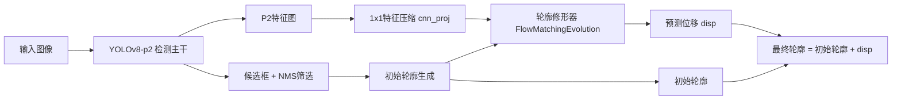
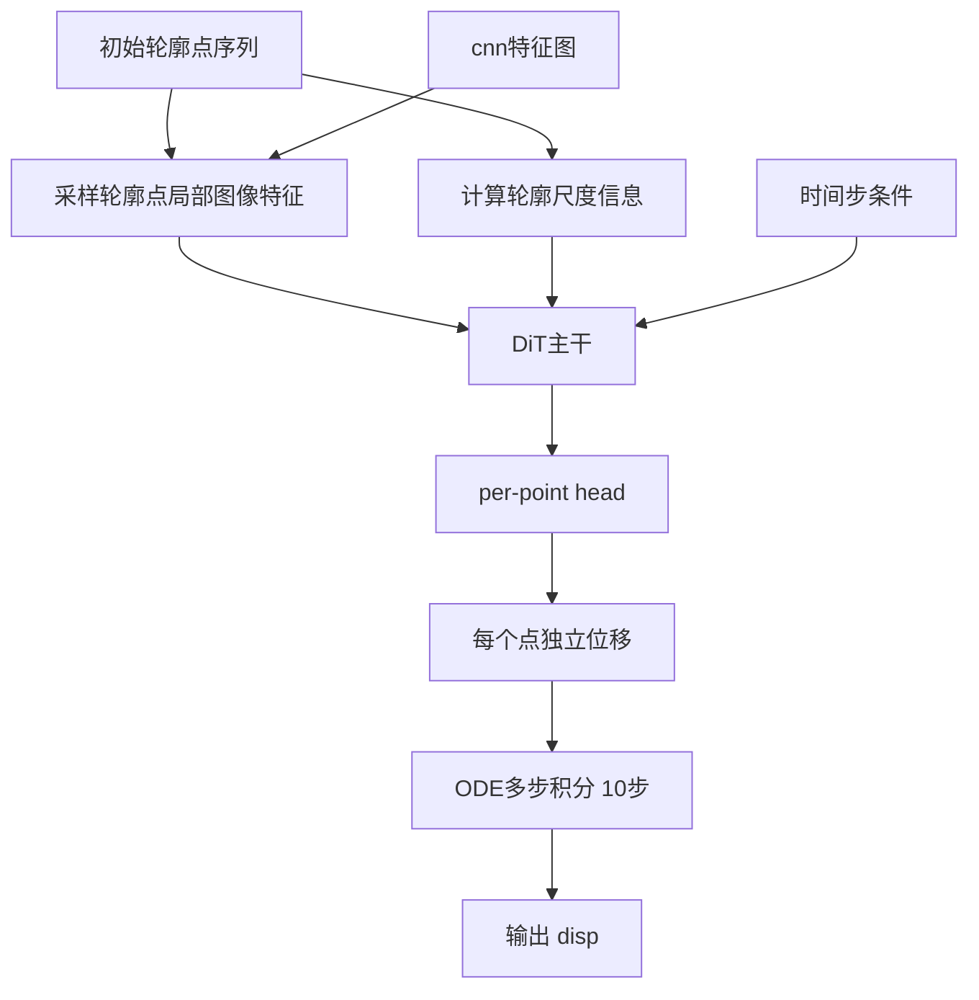
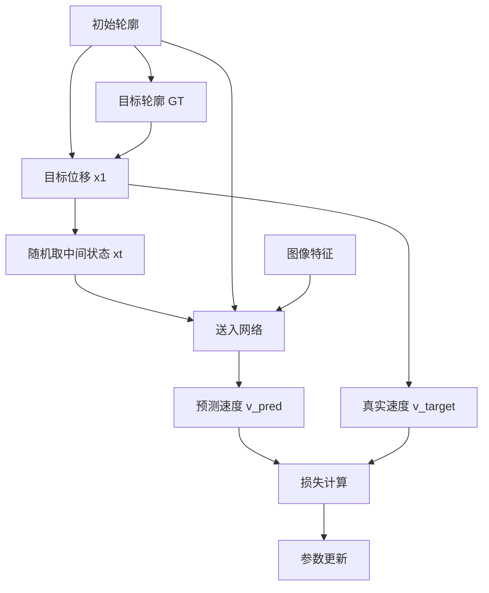
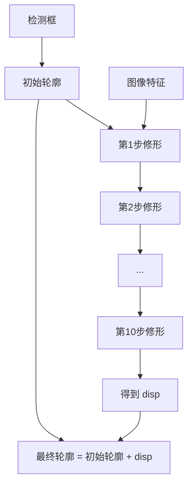

# V3.7-v6b 结构详图（升级版）

## 一眼看懂

V3.7-v6b 的核心不是“直接画轮廓”，而是先给一个初始轮廓，再一步步把它修到边界上。  
你可以把它看成：`检测器 + 轮廓修形器`。

---

## 1) 总体分层图（模块级）

---

## 2) 轮廓修形器内部图（V3.7-v6b）

---

## 3) 训练路径（细化版）

---

## 4) 推理路径（细化版）

---

## 5) 关键模块对应表

| 位置 | 作用 | 在 V3.7-v6b 的状态 |
|---|---|---|
| YOLOv8-p2 | 找目标位置、给粗框 | 开启 |
| NMS | 去掉重复候选 | 开启 |
| 初始轮廓生成 | 给修形器一个起点 | 开启 |
| Flow Matching | 学“怎么把轮廓推到边界” | 开启 |
| per-point head | 每个点单独预测，不共用同一输出头 | 开启 |
| scale conditioning | 让不同尺寸轮廓都能稳定处理 | 开启 |
| ODE steps | 推理时分多步更新 | 10 步 |

---

## 6) 这版比上一版补强了什么

- 模块拆分到“检测、起点、修形”三层，不再混在一张图里  
- 单独画了“修形器内部图”，能看清核心结构  
- 训练和推理分开画，路径不再重叠  
- 增加关键模块表，方便快速对照配置

---

## 7) 你后面可直接复用的看图顺序

1. 先看“总体分层图”确定大框架  
2. 再看“修形器内部图”理解模型本体  
3. 最后看“训练路径 / 推理路径”区分两种流程

