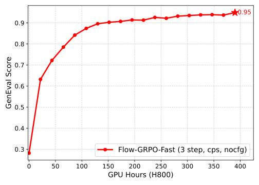
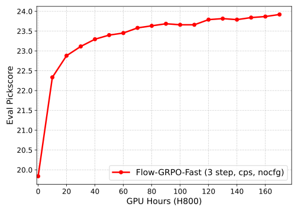
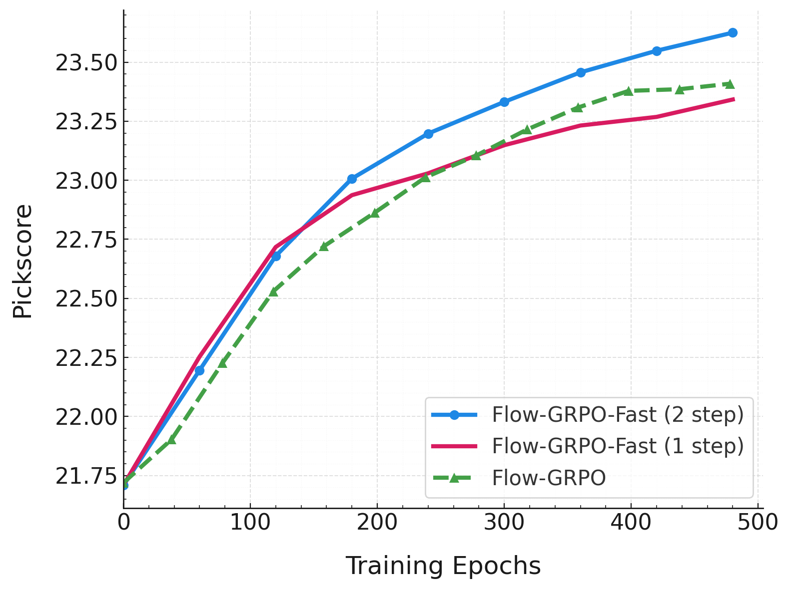

<h1 align="center">Flow-GRPO：<br>通过在线强化学习训练 Flow Matching 模型</h1>
<div align="center">
  <a href='https://arxiv.org/abs/2505.05470'></a>&nbsp;
  <a href='https://gongyeliu.github.io/Flow-GRPO/'></a>&nbsp;
  <a href="https://github.com/yifan123/flow_grpo"></a>&nbsp;
  <a href='https://huggingface.co/collections/jieliu/sd35m-flowgrpo-68298ec27a27af64b0654120'></a>&nbsp;
  <a href='https://huggingface.co/spaces/jieliu/SD3.5-M-Flow-GRPO'></a>&nbsp;
</div>

<p align="center">
  <a href="README.md">English</a> | <strong>简体中文</strong>
</p>

## 更新日志
<details open>
<summary><strong>2025-10-14</strong></summary>

- 重构 FlowGRPO-Fast 以与 FlowGRPO 保持一致；在 SD3 上新增 CPS 采样与无-CFG 训练支持。

</details>

<details>
<summary><strong>历史更新</strong></summary>

- 2025-08-15：新增对 Qwen-Image / Qwen-Image-Edit 的支持。
- 2025-08-15：感谢 Jing Wang 贡献 Wan2.1 支持（参见 `scripts/train_wan2_1.py` 与 `config/grpo.py:general_ocr_wan2_1`）。
- 2025-08-14：补充 Flow-GRPO-Fast 与 Flow-GRPO 的奖励曲线对比；仅 2 步训练即可在 Pickscore 回报上接近 Flow-GRPO。
- 2025-08-04：新增对 FLUX.1-Kontext-dev 的支持（计数编辑任务，Geneval 计数 + CLIP 相似度）；提供可运行范例，但数据仅 800 条，仍需社区探索。
- 2025-07-31：加入 Flow-GRPO-Fast。
- 2025-07-28：新增 FLUX.1-dev 支持；新增 CLIPScore 作为奖励；`config.sample.same_latent` 用于控制相同 prompt 是否复用同一噪声。
- 2025-05-15：三项任务的训练演化示例已上线可视化与在线 Demo。

</details>

## 项目简介
Flow-GRPO 提供了一套将在线 RL（组相对策略优化，GRPO）用于 Flow Matching 文生图模型（如 SD3.5、FLUX、Qwen-Image 等）的通用训练框架。我们同时提供加速变体 Flow-GRPO-Fast：在每条轨迹上仅对 1–2 个去噪步进行训练，通过在中间步注入噪声并切换为 SDE 生成一个 group，显著降低训练开销而保持回报表现。

实践中，我们发现如下策略显著提升效率与表现：
- 训练与评测阶段均使用无-CFG（No-CFG）；在线 RL 等效地完成了“CFG 蒸馏”。
- 采用 Flow-GRPO-Fast 的“窗口机制”或 MixGRPO 思想，仅在部分步上训练。
- 结合 CPS（Coefficients-Preserving Sampling）采样，常用设置 `noise_level = 0.8` 在不同模型与步数下无需调参即可取得稳定增益。

如下图所示（详见 `config/grpo.py` 的 `geneval_sd3_fast_nocfg` 与 `pickscore_sd3_fast_nocfg` 配置，并使用 `scripts/multi_node/sd3_fast` 脚本复现），在 Geneval 与 PickScore 奖励上，无-CFG 的训练与评测均能获得优良的收敛表现。

<p align="center">
  
  
</p>

Flow-GRPO-Fast 进一步带来两点收益：
- 每条轨迹仅训练 1–2 次，大幅降低训练成本；
- 分支前仅需 1 个 prompt 采样，数据收集更快。

PickScore 任务上，Flow-GRPO-Fast 的测试回报可与标准 Flow-GRPO 持平。如下图，横轴为 epoch：每次迭代训练 2 个步的 Fast 版本优于标准 Flow-GRPO；仅 1 个步时略逊于标准版，但训练效率都显著更高。

<p align="center">
  
</p>

请使用 `scripts/multi_node/sd3_fast` 下的脚本来复现实验。

## 快速开始

### 1. 环境安装
```bash
git clone https://github.com/yifan123/flow_grpo.git
cd flow_grpo
conda create -n flow_grpo python=3.10.16
pip install -e .
```

### 2. 预下载模型
为避免多卡训练时的重复下载与存储浪费，建议提前拉取所需模型：

- 基础模型
  - SD3.5：`stabilityai/stable-diffusion-3.5-medium`
  - Flux：`black-forest-labs/FLUX.1-dev`

- 奖励模型（按需）
  - PickScore：`laion/CLIP-ViT-H-14-laion2B-s32B-b79K` 和 `yuvalkirstain/PickScore_v1`
  - CLIPScore：`openai/clip-vit-large-patch14`
  - Aesthetic Score：`openai/clip-vit-large-patch14`

### 3. 奖励服务与依赖
各奖励模型的依赖版本差异较大，统一安装容易冲突。参考 ddpo-pytorch 的实践，我们推荐将奖励服务部署在独立环境/远端服务上，仅安装你要用到的奖励类型。

- Geneval：新建 Conda 环境，按 <a href="https://github.com/yifan123/reward-server">reward-server</a> 说明部署。
- OCR：
  ```bash
  pip install paddlepaddle-gpu==2.6.2
  pip install paddleocr==2.9.1
  pip install python-Levenshtein
  ```
  预拉取 OCR 模型（Python 交互式环境）：
  ```python
  from paddleocr import PaddleOCR
  ocr = PaddleOCR(use_angle_cls=False, lang="en", use_gpu=False, show_log=False)
  ```
- PickScore：无需额外安装。建议使用 SFW 版本数据集 `dataset/pickscore_sfw`（对应 HuggingFace 上的 `CarperAI/pickapic_v1_no_images_training_sfw`）。
- DeQA：新建 Conda 环境，按 <a href="https://github.com/yifan123/reward-server">reward-server</a> 说明部署。
- UnifiedReward：建议独立环境（避免 `sglang` 冲突）。
  ```bash
  conda create -n sglang python=3.10.16
  conda activate sglang
  pip install "sglang[all]"
  # 启动服务
  python -m sglang.launch_server \
    --model-path CodeGoat24/UnifiedReward-7b-v1.5 \
    --api-key flowgrpo \
    --port 17140 \
    --chat-template chatml-llava \
    --enable-p2p-check \
    --mem-fraction-static 0.85
  ```
- ImageReward：
  ```bash
  pip install image-reward
  pip install git+https://github.com/openai/CLIP.git
  ```

### 4. 启动训练

#### GRPO（在线 RL）

- 单机：
  ```bash
  # SD3.5
  bash scripts/single_node/grpo.sh
  # FLUX
  bash scripts/single_node/grpo_flux.sh
  ```

- 多机（SD3.5）：
  ```bash
  # 主节点
  bash scripts/multi_node/sd3/main.sh
  # 其他节点
  bash scripts/multi_node/sd3/main1.sh
  bash scripts/multi_node/sd3/main2.sh
  bash scripts/multi_node/sd3/main3.sh
  ```

- 多机（FLUX.1-dev）：
  ```bash
  # 主节点
  bash scripts/multi_node/flux/main.sh
  # 其他节点
  bash scripts/multi_node/flux/main1.sh
  bash scripts/multi_node/flux/main2.sh
  bash scripts/multi_node/flux/main3.sh
  ```

- 多机（FLUX.1-Kontext-dev）：
  先下载并解压 <a href="https://huggingface.co/datasets/jieliu/counting_edit/blob/main/generated_images.zip">generated_images.zip</a> 到 `counting_edit` 目录；或使用 `counting_edit` 下脚本自制数据。为支持 Kontext，请从主分支安装 `diffusers`：
  ```bash
  pip install git+https://github.com/huggingface/diffusers.git
  ```
  安装后如遇 PEFT 等依赖冲突，请按报错升级。然后：
  ```bash
  # 主节点
  bash scripts/multi_node/flux_kontext/main.sh
  # 其他节点
  bash scripts/multi_node/flux_kontext/main1.sh
  bash scripts/multi_node/flux_kontext/main2.sh
  bash scripts/multi_node/flux_kontext/main3.sh
  ```

- 多机（Qwen-Image）：
  Qwen-Image 的实现将 Flow-GRPO 与 Flow-GRPO-Fast 统一，可通过 `config.sample.sde_window_size` 控制 SDE 窗口大小，`config.sample.sde_window_range` 控制窗口位置。需从主分支安装 `diffusers`：
  ```bash
  pip install git+https://github.com/huggingface/diffusers.git
  ```
  运行脚本：
  ```bash
  # 主节点
  bash scripts/multi_node/qwenimage/main.sh 0
  # 其他节点
  bash scripts/multi_node/qwenimage/main.sh 1
  bash scripts/multi_node/qwenimage/main.sh 2
  bash scripts/multi_node/qwenimage/main.sh 3
  ```

- 多机（Qwen-Image-Edit）：
  同 Kontext，先下载并解压 `generated_images.zip` 到 `counting_edit`。安装 `diffusers` 主分支版本后：
  ```bash
  # 主节点
  bash scripts/multi_node/qwenimage_edit/main.sh 0
  # 其他节点
  bash scripts/multi_node/qwenimage_edit/main.sh 1
  bash scripts/multi_node/qwenimage_edit/main.sh 2
  bash scripts/multi_node/qwenimage_edit/main.sh 3
  ```

#### DPO / OnlineDPO / SFT / OnlineSFT

- 单机：
  ```bash
  bash scripts/single_node/dpo.sh
  bash scripts/single_node/sft.sh
  ```
- 多机：
  请在 `scripts/multi_node` 下的对应 bash 中修改入口 Python 与配置函数名。

## 多奖励训练（加权融合）
支持传入字典形式的加权配置，例如：

```python
{
  "pickscore": 0.5,
  "ocr": 0.2,
  "aesthetic": 0.3
}
```

当前支持的奖励类型包括：Geneval、OCR、PickScore、DeQA、ImageReward、QwenVL（实验性）、Aesthetic、JPEG_Compressibility、UnifiedReward 等。

## 重要超参数与经验
请在 `config/grpo.py` 中调整超参数。一个实用经验是：

- 令 `config.sample.train_batch_size * num_gpu / config.sample.num_image_per_prompt * config.sample.num_batches_per_epoch = 48`（即 group_number=48，group_size=24）。
- 设置 `config.train.gradient_accumulation_steps = config.sample.num_batches_per_epoch // 2`。

FAQ 要点：
- 优先使用 fp16 训练（较 bf16 的 logprob 误差更小）；但 Flux/Wan 推理需 bf16，故训练也需 bf16。此时建议只在高噪步训练，logprob 误差通常更小（感谢 Jing Wang 的观察）。
- 使用 Flow-GRPO-Fast 时，将 `clip_range` 设得更小，否则可能不稳定。
- 新增模型时请检查不同 batch size 下输出是否有微小差异（SD3 存在此现象）。确保训练 batch 与采样 batch 保持一致可避免偏差。

## 如何接入新模型
以 SD3 为例，需完成以下适配工作（其他模型类比）：

1) 适配以下文件：
- `flow_grpo/diffusers_patch/sd3_pipeline_with_logprob.py`：从 diffusers 的对应 pipeline 改写，加入 logprob 与训练所需接口。
- `scripts/train_sd3.py`：基于 diffusers DreamBooth 示例改写的训练入口。
- `flow_grpo/diffusers_patch/sd3_sde_with_logprob.py`：负责 SDE 采样；通常无需改动，但若 `dt`、`velocity` 的定义/符号不同需同步调整。

2) 验证 SDE 采样：
- 在 `scripts/demo/sd3_sde_demo.py` 中设 `noise_level = 0`，确认生成图像正常，以确保 SDE 实现正确。

3) 确保严格 on-policy：
- 设 `config.sample.num_batches_per_epoch = 1` 与 `config.train.gradient_accumulation_steps = 1`，此时采样与训练模型完全一致；训练脚本中的 `ratio` 应保持为 1，否则需检查采样与训练路径是否一致（如是否使用 `torch.compile` 或不同的包装器）。

4) 调好奖励与噪声：
- 从 `config.train.beta = 0` 开始，观察奖励是否能单调上升；必要时调整 `flow_grpo/diffusers_patch/sd3_sde_with_logprob.py` 中噪声水平。其余超参通常可保持默认。

## 目录结构速览
- `config/`：训练/采样/奖励等配置（核心：`config/grpo.py`）。
- `flow_grpo/`：算法与模型适配实现（含 diffusers patch、SDE、LogProb 等）。
- `dataset/`：数据示例与清单（如 `pickscore`、`geneval`、`ocr` 等）。
- `scripts/`：单机与多机场景的启动脚本，含 `train_*.py` 与各任务的 `*.sh`。
- `setup.py`：安装与依赖入口（开发模式 `pip install -e .`）。

## 许可证
本项目基于 MIT License 开源，详见 `LICENSE`。

## 致谢
本仓库受益于优秀的开源生态：主要参考与复用 <a href="https://github.com/kvablack/ddpo-pytorch">ddpo-pytorch</a> 与 <a href="https://github.com/huggingface/diffusers">diffusers</a>。特别感谢 Kevin Black 对 ddpo-pytorch 的贡献。

## 引用
如本项目/论文对你的研究或产品有帮助，请引用：

```
@article{liu2025flow,
  title={Flow-grpo: Training flow matching models via online rl},
  author={Liu, Jie and Liu, Gongye and Liang, Jiajun and Li, Yangguang and Liu, Jiaheng and Wang, Xintao and Wan, Pengfei and Zhang, Di and Ouyang, Wanli},
  journal={arXiv preprint arXiv:2505.05470},
  year={2025}
}
```

如使用 Flow-DPO，也欢迎引用：

```
@article{liu2025improving,
  title={Improving video generation with human feedback},
  author={Liu, Jie and Liu, Gongye and Liang, Jiajun and Yuan, Ziyang and Liu, Xiaokun and Zheng, Mingwu and Wu, Xiele and Wang, Qiulin and Qin, Wenyu and Xia, Menghan and others},
  journal={arXiv preprint arXiv:2501.13918},
  year={2025}
}
```

